# Aplicaciones Geoespaciales con PostgreSQL y Node.js

Hoy día los navegadores tienen acceso a información precisa sobre su ubicación
actual. Esta información puede ser aprovechada por las aplicaciones para
proveer servicios altamente personalizados y contextuales, generando así una
experiencia de usuario más agradable.

En este taller los participantes crearán una aplicación geoespacial utilizando
PostgreSQL y Node.js.

La aplicación permitirá:
- Agregar lugares a una base de datos, utilizando sus coordenadas geográficas
- Realizar búsquedas con auto-completado (full-text search)
- Búsqueda dentro de un radio o área geográfica determinada

Al finalizar el taller los participantes tendrán suficiente conocimiento para
crear su propia aplicación geoespacial utilizando herramientas de software libre.

Tiempo total: 90 mins

## Antes del Taller
1. Instala Docker y Docker-Compose
  - Windows o MacOS con soporte de [Hyper-V](http://www.zdnet.com/article/windows-10-tip-find-out-if-your-pc-can-run-hyper-v/): 
      - [Docker for Mac](https://store.docker.com/editions/community/docker-ce-desktop-mac)
      - [Docker for Windows](https://docs.docker.com/docker-for-windows/install/#download-docker-for-windows)
  - Windows o MacOS sin soporte de Hyper-V: 
      - [Docker Toolbox](https://docs.docker.com/toolbox/overview/)
  - Ubuntu:
      - [Docker CE for Ubuntu](https://docs.docker.com/engine/installation/linux/docker-ce/ubuntu/)
      - [Docker Compose](https://docs.docker.com/compose/install/)

2. Descarga este repositorio a tu computadora
  ```
  git clone git@github.com:alexishevia/postgres_geoespacial.git
  ```

3. Arranca el proyecto:
  ```
  cd postgres_geoespacial
  docker-compose up
  ```

4. Revisa que el frontend arranca correctamente:  
  Al entrar a http://localhost:3000/ debes ver un mensaje de "Error al cargar paradas".
  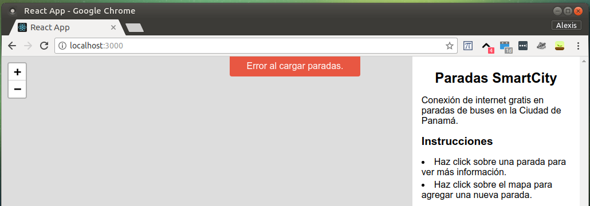

5. Revisa que el backend arranca correctamente:  
  Al entrar a http://localhost:3001/ debes ver un mensaje de "Backend is Working!"
  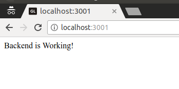

6. Revisa que puedes acceder a la base de datos:  
  Al correr este comando debes tener acceso a psql
  ```
  docker-compose exec postgres psql postgres://geoapp@postgres/geoapp
  ```
  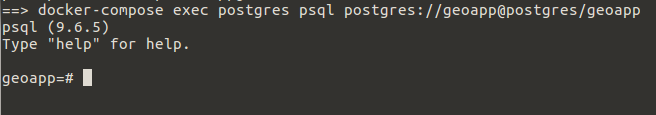

7. Descarga los archivos de Denver.  
  Descarga el archivo [crime.csv](https://www.denvergov.org/media/gis/DataCatalog/crime/csv/crime.csv) y colócalo dentro de la carpeta `sampleData`.

8. Configura servicio de tiles:

8.1 Entra a http://localhost:3002/.  
  Debes ver el wizard de "OpenMapTiles Map Server". Da click en "Start".
  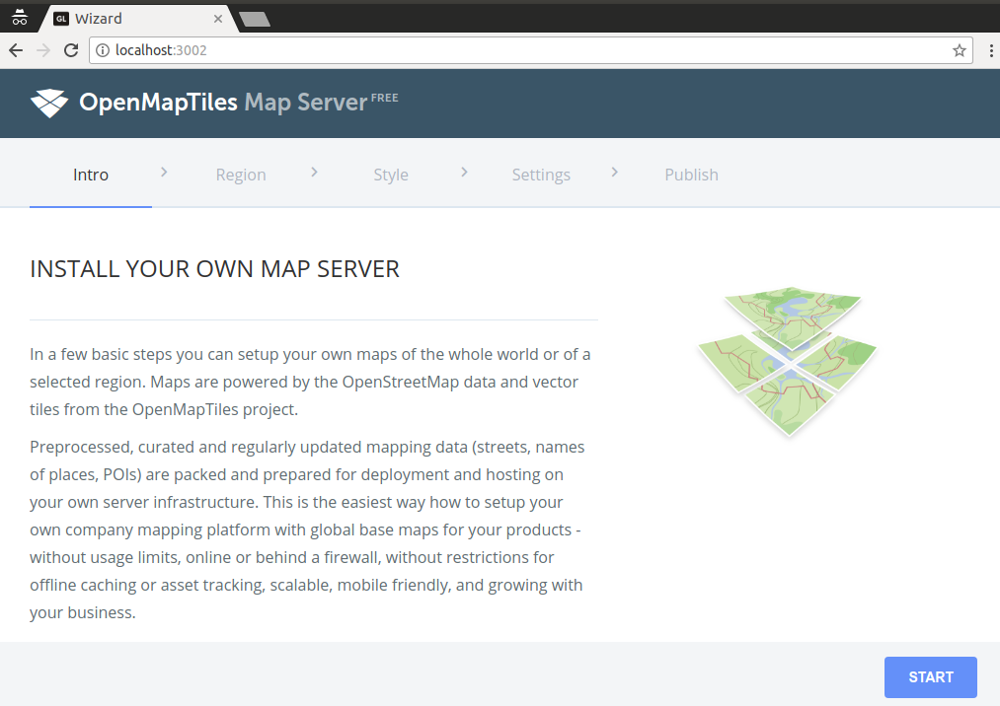

8.2 Selecciona la región de "Central America" y da click en "Continue".
  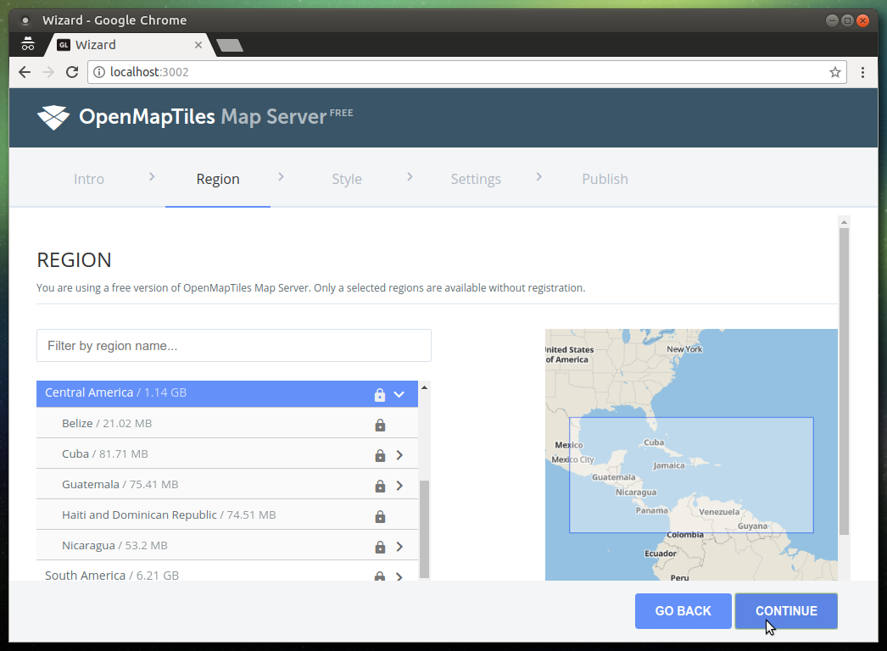

8.3 Selecciona el estilo "OSM Bright" y da click en "Continue".
  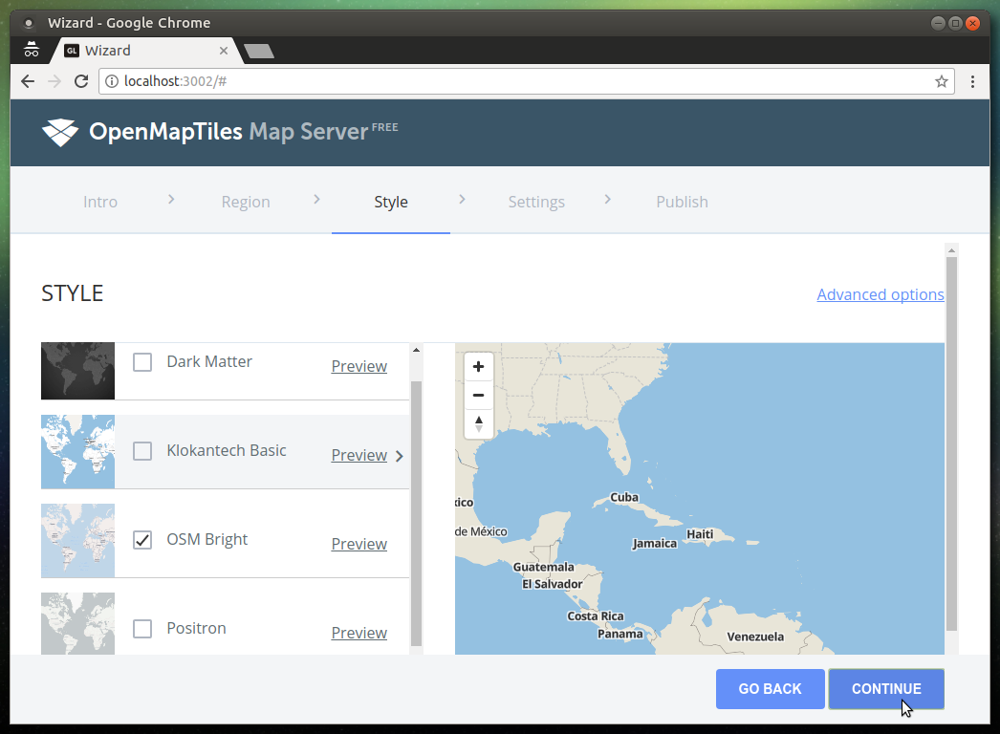

8.4 Selecciona el setting de "Serve raster map tiles" y da click en "Save & Run The Server"
  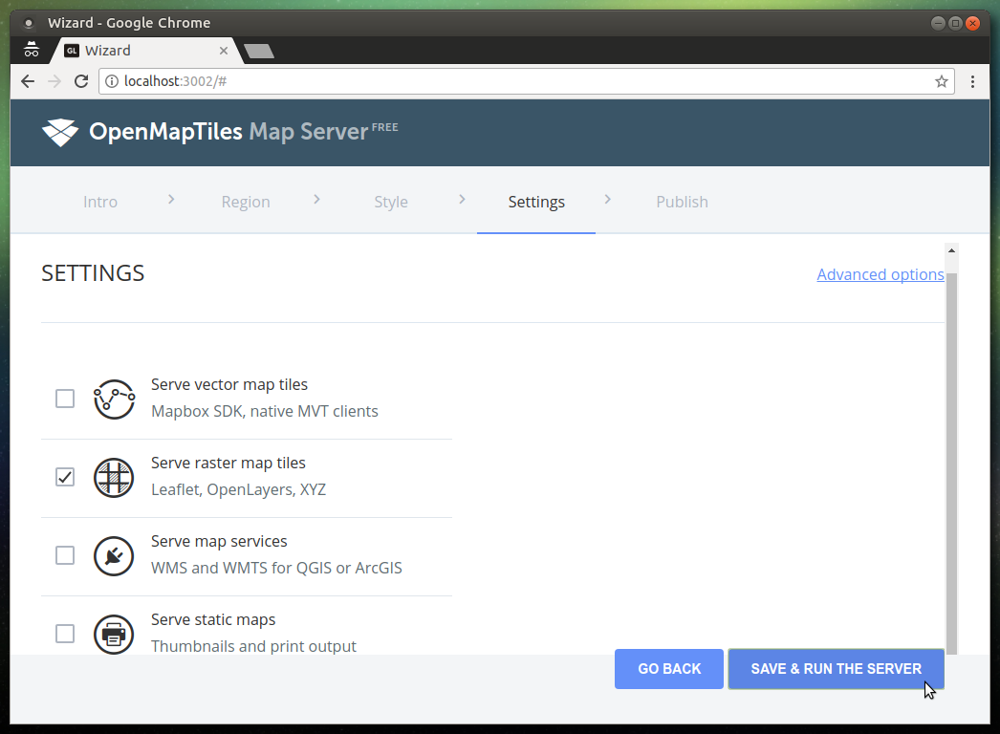

8.5 Da click en el link para obtener tu clave personal.
  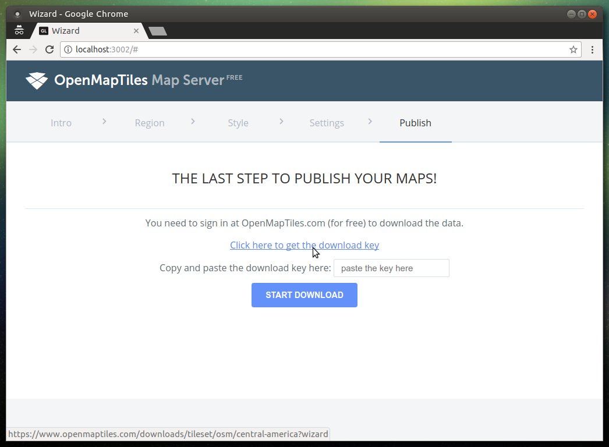

8.6 Selecciona "evaluation and education purpose" y copia la clave abajo a la derecha.
  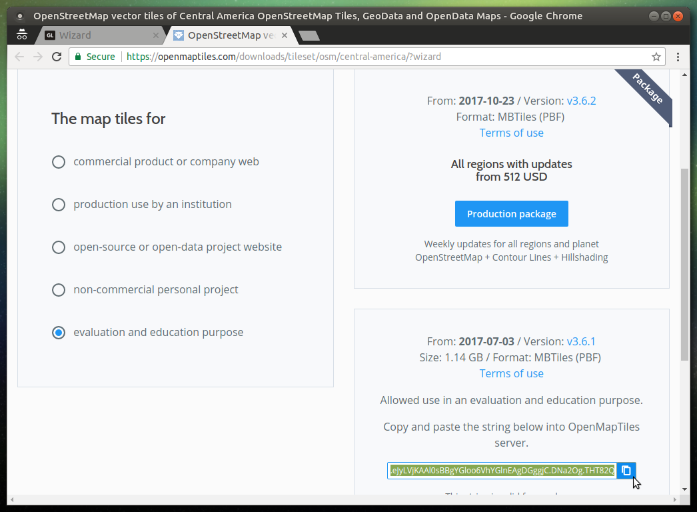

8.8 Pega tu clave en la ventana de descarga y da click en "Start Download"
  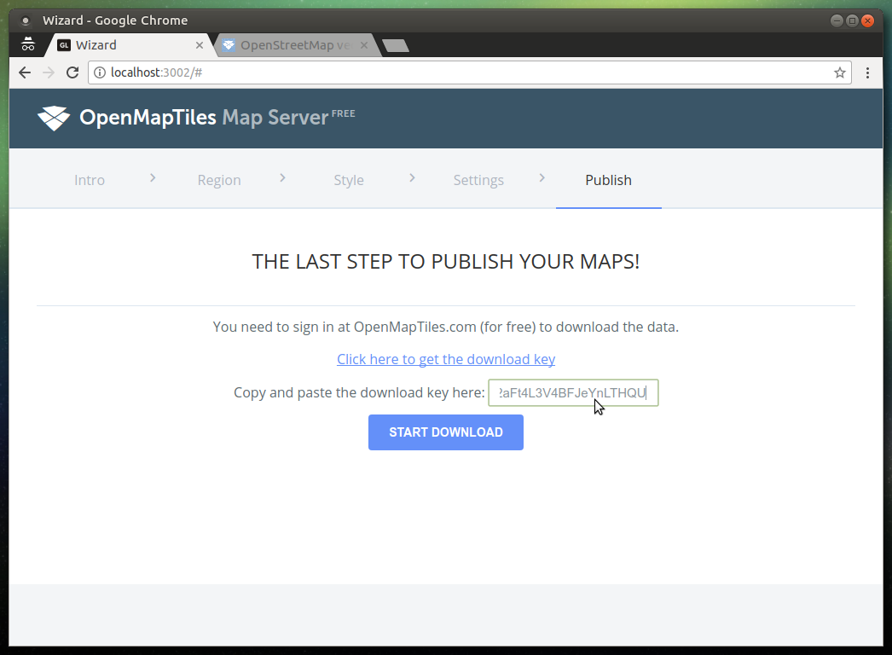
  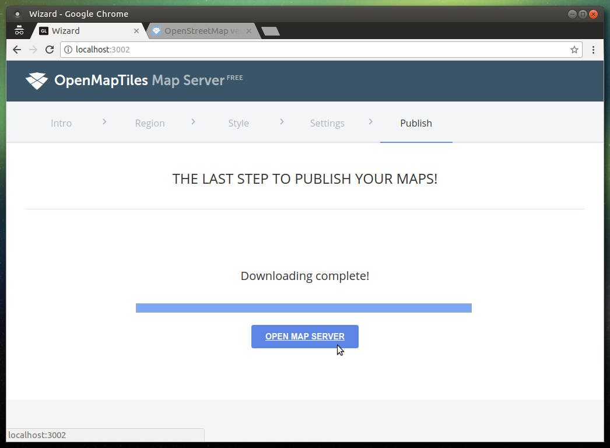
